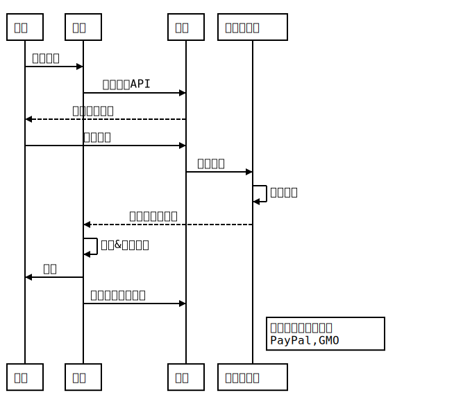

# 模板
# 一级标题
## 二级标题
### 三级标题
#### 四级标题

1. 项目1
2. 项目2
   * 项目2.1
   * 项目2.2
   * `此处为灰体`
   * [此处为链接](http://www.test.com)
   * 此处有**加粗**
## 图片链接
   
   
## github style table
| Tables        | Are           | Cool  |
| ------------- |:-------------:| -----:|
| col 3 is      | right-aligned | $1600 |
| col 2 is      | centered      |   $12 |
| zebra stripes | are neat      |    $1 |   

::: danger 危险
danger
:::

::: tip 提示
tip
:::

::: warning 警告
warning
:::

``` js{5}
test code
```